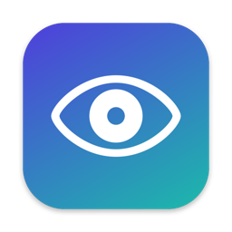

<p align="center"></p>

<h1 align="center">OpenLookAway</h1>

<p align="center">A free, open-source break reminder for your Mac.<br>Rest your eyes, fix your posture, and keep your flow.</p>

<p align="center"><a href="https://lookaway.yoelgal.com">lookaway.yoelgal.com</a></p>

## Install

Paste this into Terminal:

```sh
curl -fsSL https://lookaway.yoelgal.com/install.sh | bash
```

That's it. It downloads the latest release to `/Applications` and opens it. Look for the eye in your menu bar.

Or with Homebrew: `brew install --cask yoelgal/tap/openlookaway`

Requires macOS 14 (Sonoma) or newer. Runs natively on Apple Silicon and Intel.

<details>
<summary>Why a terminal command? / Manual install</summary>

OpenLookAway isn't notarized by Apple (that needs a paid developer account). macOS blocks
unnotarized apps downloaded in a browser, but not ones fetched with `curl`, so the one-liner
just works. [Read the script](site/install.sh): it's 50 lines.

**Manual install:** download `OpenLookAway.zip` from the [latest release](https://github.com/yoelgal/openlookaway/releases/latest),
unzip it, and drag **OpenLookAway** to Applications. The first time you open it, macOS will say it
can't verify the developer. Click **Done**, then go to **System Settings → Privacy & Security**,
scroll down, and click **Open Anyway**. You only need to do this once.

Or run this after dragging it to Applications: `xattr -dr com.apple.quarantine "/Applications/OpenLookAway.app"`
</details>

## Features

- **20-20-20 breaks.** A gentle full-screen break every 20 minutes (configurable), with longer breaks every few rounds.
- **Heads-up first.** A small card appears a few seconds before each break so you can finish your sentence, snooze, or skip.
- **Smart pause.** Pauses automatically during calls and meetings (mic in use) and, optionally, when an app is fullscreen.
- **Knows when you're away.** Stepping away or sleeping your Mac counts as a break, and the timer starts fresh.
- **Blink and posture nudges.** Optional quiet reminders in the corner.
- **Your messages.** Write your own break prompts.
- **Menu bar native.** Countdown in the menu bar, pause for 30m / 1h / 2h, take a break now, and see today's stats.
- **Private.** No account, no analytics, no network calls except checking GitHub for updates.
- **Tiny.** No dependencies and no Electron. It's about 700 lines of Swift.

## Update

Use **Check for Updates…** in the menu, or run the install command again.

## Uninstall

Quit from the menu, then drag **OpenLookAway** from Applications to the Trash.

## Build from source

```sh
git clone https://github.com/yoelgal/openlookaway && cd openlookaway
scripts/build.sh          # → dist/OpenLookAway.app
```

Needs Xcode 15+ (or the Command Line Tools with Swift 5.9+). Releases are built by GitHub Actions from tags (`git tag v1.2.3 && git push --tags`).

## Credits

Inspired by [LookAway](https://lookaway.com), a polished paid app. If you want iPhone sync, Live Activities, and more, go buy it. This project isn't affiliated with it.

MIT licensed.
