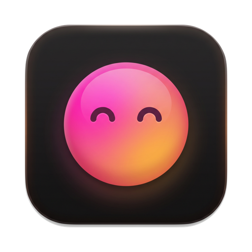
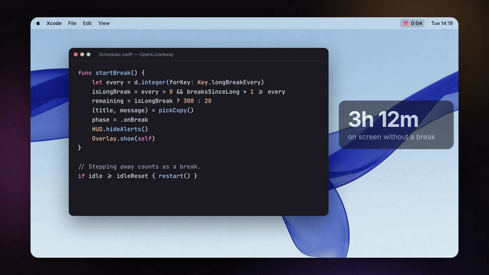

<p align="center"></p>

<h1 align="center">OpenLookAway</h1>

<p align="center">A free, open-source break reminder for your Mac.<br>Rest your eyes, fix your posture, and keep your flow.</p>

<p align="center"><a href="https://lookaway.yoelgal.com">lookaway.yoelgal.com</a></p>

<p align="center"><a href="https://lookaway.yoelgal.com/assets/demo.mp4"></a><br><sub>▶ <a href="https://lookaway.yoelgal.com/assets/demo.mp4">Watch the full 25-second demo with sound</a> · <a href="site/assets/demo-sound-credits.txt">sound credits</a></sub></p>

## Install

Paste this into Terminal:

```sh
curl -fsSL https://lookaway.yoelgal.com/install.sh | bash
```

That's it. It downloads the latest release to `/Applications` and opens it. Look for the little face in your menu bar.

Or with Homebrew: `brew install --cask yoelgal/tap/openlookaway`

Requires macOS 14 (Sonoma) or newer. Runs natively on Apple Silicon and Intel.

<details>
<summary>Why a terminal command? / Manual install</summary>

OpenLookAway isn't notarized by Apple (that needs a paid developer account). macOS blocks
unnotarized apps downloaded in a browser, but not ones fetched with `curl`, so the one-liner
just works. [Read the script](site/install.sh): it's 50 lines.

**Manual install:** download `OpenLookAway.zip` from the [latest release](https://github.com/yoelgal/openlookaway/releases/latest),
unzip it, and drag **OpenLookAway** to Applications. The first time you open it, macOS will say it
can't verify the developer. Click **Done**, then go to **System Settings → Privacy & Security**,
scroll down, and click **Open Anyway**. You only need to do this once.

Or run this after dragging it to Applications: `xattr -dr com.apple.quarantine "/Applications/OpenLookAway.app"`
</details>

## Features

- **Gentle breaks.** Every 20 minutes (you choose), your wallpaper blurs into a calm break screen with a countdown. Longer stretch breaks every few rounds.
- **A heads-up first.** A card drops in before each break: start now, or push it back 1, 5 or 15 minutes. In the last five seconds a small countdown follows your cursor.
- **Your rules.** Casual (skip anytime), Balanced (skip after a pause) or Hardcore (no skips), plus a daily snooze budget. Double Esc to skip or snooze, and one click to lock your Mac.
- **Smart pause.** Waits during calls and meetings, and optionally during video playback or fullscreen apps. Stepping away counts as a natural break.
- **Posture and blink nudges.** Little animated reminders that appear for a few seconds and get out of your way.
- **Menu bar native.** Countdown in the menu bar; a panel with a progress ring, pause and skip, and Today's Screen Score with break and screen-time stats.
- **Make it yours.** Break-screen backgrounds (blurred wallpaper, gradient, or your own image), custom messages, and sounds.
- **Private.** No account and no analytics. The only network call checks GitHub for updates.
- **Native and tiny.** Swift and SwiftUI, no dependencies, no Electron.

## Update

Use **Check for Updates…** in the menu, or run the install command again.

## Uninstall

Quit from the menu, then drag **OpenLookAway** from Applications to the Trash.

## Build from source

```sh
git clone https://github.com/yoelgal/openlookaway && cd openlookaway
scripts/build.sh          # → dist/OpenLookAway.app
```

Needs Xcode 15+ (or the Command Line Tools with Swift 5.9+). Releases are built by GitHub Actions from tags (`git tag v1.2.3 && git push --tags`).

## Credits

Inspired by [LookAway](https://lookaway.com), a polished paid app. If you want iPhone sync, Live Activities, and more, go buy it. This project isn't affiliated with it.

MIT licensed.
